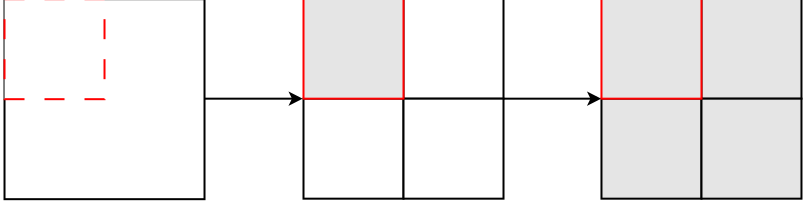
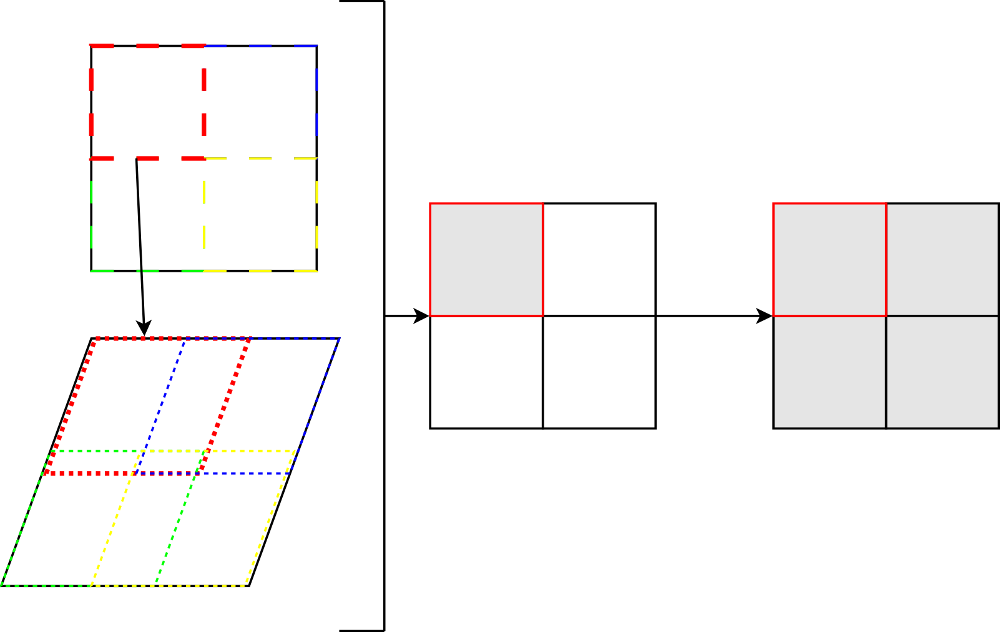

.. _decomposition:

#############################
Decomposition and parallelism
#############################

The decomposition module provides code to help you divide your processing into
smaller pieces which can fit into memory and even be run in parallel.
The decomposition framework will deal with splitting your cubes into sub cubes,
running the processing, and combining the results back into a single cube.
You need to define a function that can work on a portion of a cube to do your
processing, the decomposition framework will do the rest.
The decomposition processing will return either a single iris Cube or an iris
CubeList, depending on the context. For the full set of
reference documentation, the reader is referred to :mod:`ants.decomposition`.

Setting the ANTS_TEMPORARY_DIR environment variable allows the user
to choose where potentially large volumes of temporary working files
are written and then cleaned up during the decomposition processing.

.. _unary_binary_definition:

Decomposition can utilise either *unary* or *binary* operations.

In the :ref:`unary <unary_binary_definition>`
case, we deal with source datasets that are turned into a mosaic via a
class generator factory and dealt with piecemeal.

In the :ref:`binary <unary_binary_definition>` case, the target datasets are
decomposed to make a mosaic in the same way that the source is in the unary
case.  Each piece of these target mosaic pieces are then used to retrieve the
corresponding overlapping source piece.  The :ref:`binary <unary_binary_definition>`
operation is then performed with each source-target pair.

*****
Usage
*****

Usage of the decomposition framework can be achieved via a helper function
(:func:`ants.decomposition.decompose`):

No decomposition::

    res = operation(source, target)

Decomposition::

    res = decomp.decompose(operation, source, target)

.. autofunction:: ants.decomposition.decompose
    :noindex:

Example use-case
================

.. _unary-example:

Unary Example
-------------

Let's begin by defining a :ref:`unary <unary_binary_definition>` function::

    def operation_unary(a):
        return a + 1

Now define a sample cube::

    import iris.tests.stock as stock
    source = stock.lat_lon_cube()

This is how we might call our function with this :class:`~iris.cube.Cube`
without decomposition::

    res = operation_unary(source)

To repeat the process utilising decomposition, first import the relevant
module::

    import ants.decomposition as decomp

Now, perform the operation utilising decomposition.  We translate as
follows::

    res = decomp.decompose(operation_unary, source)

Binary Example
--------------

Now let's define a :ref:`binary <unary_binary_definition>` function::

    def operation_binary(a, b):
        return a + b

This time we will need to define a target grid::

    target = stock.lat_lon_cube()

This is how we would call this without decomposition::

    res = operation_binary(source, target)

Now let's utilise decomposition in exactly the same way as we did in the
:ref:`unary case <unary-example>`, passing this time both our source(s) and
target(s)::

    res = decomp.decompose(operation_binary, source, target) 

.. _advanced_usage:

Extended Usage
--------------

In some cases your processing function may have arguments other than the source
and/or target cubes.  The python function :py:func:`functools.partial` can be
used to help you turn these processing functions into a form usable by the
decomposition module.

A basic example of this is shown here::

    from functools import partial

    def operation_unary(a, base=0):
        return a + 1 + base

    # set the values of the keyword argument for decomposition framework
    process_func = partial(operation_unary, base=10)
    res = decomp.decompose(process_func, mosaic)

*********
Debugging
*********

There are a number of ways of debugging problems and often we can continue
utilising decomposition:

1. Configure decomposition to utilise only a single process (serial decomposition).
   Using only a single process is an effective way of debugging. This will likely
   improve the exception messages presented (as everything happens on a single
   process).  This also enables us to utilise debugging tools such as :mod:`pdb`.
2. Switch the operation that you are providing the decomposition framework with,
   to a dummy one.  A useful operation, might be to plot something.
   This will inform you of whether the operation/decomposition behaves in the
   way you expect.  For example, let's define an operation which plots the
   source-target pair coverage each time the operation is called (i.e. for each
   source-target chunk)::

    def operation(source, target):
        _debug_plot([src, 'r', 'Source chunk {}'.format(ind+1)],
                    [tgt, 'b', 'Target chunk {}'.format(ind+1)],
                            title='Decomposition debug')
        return source

    def debug_plot(*args, **kwargs):
        import iris.plot as iplt
        iplt.plt.switch_backend('TkAgg')

        def plot_cube(cube, edgecolor, label):
            cube = cube.slices([cube.coord(axis='y'), cube.coord(axis='x')])
            cube = cube.next()
            c = iplt.pcolormesh(cube, edgecolors=edgecolor, facecolors='none',
                                label=label)
            ax = iplt.plt.gca()
            ax.coastlines()
            ax.set_global()
            c._is_stroked = False
            return

        for arg in args:
            plot_cube(*arg)
        iplt.plt.title(kwargs.get('title', None))
        iplt.plt.show()

3. Make your problem smaller.  Often the greatest complexity comes from the
   sheer size of a dataset.  Perhaps as a consequence, each chunk takes some
   time to complete so debugging becomes quite inefficient.  One approach is
   to decompose a problem further still until you can iterate through a number
   of changes.  Alternative, sub-sampling the problem can be an effective way
   of dealing with something that has similar characteristics of the original
   dataset (such as geographic area coverage) but at a more manageable
   resolution.
