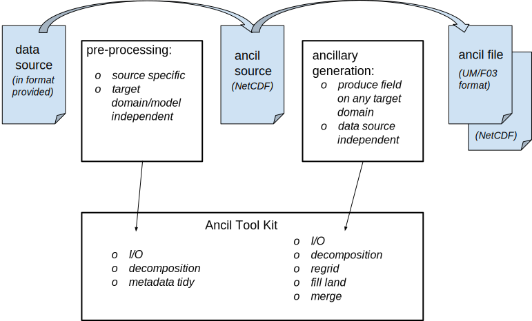

==============
 Introduction
==============

ANTS supports the generation of ancillary files. This is made up of three main components as shown in following :ref:`figure<figure_overview>`.

.. _figure_overview:

    Figure : Ancillary Tools Overview.

You will use different parts of the system depending on the task you are trying to do.

   * If you want to generate ancillary files for a new model domain then you will be working, largely, with ancillary workflows.  Ancillary workflows contain information on the ancillary files needed for a model configuration such as the GA workflow.  An ancillary workflow is a cylc workflow with rose applications for each ancillary file.  Ancillary workflows therefore also specify any dependencies between ancillary files. Ancillary workflows themselves are not a part of ANTS.
   * If you want to change the source data for an ancillary field then you will be working, largely, with ancillary processors.  An ancillary processor contains the logic of how to produce an ancillary field from source data.  It converts the source fields on the source grid to the target fields on the target grid.  An example of an ancillary processor is the production of the surface cover fractions for JULES from an input data source like IGBP.  Ancillary applications share common code like regridding or dataset merge. This code is held in the ancillary toolkit.
   * If you are adding a new ancillary field you will use code from the ancillary toolkit to build a new ancillary processing application as well as adding any new code for your ancillary field.

More details on Ancillary applications can be found :ref:`here<ancillary-applications>`.

.. _ants_principles:

Some principles and ideas in ANTS
=================================

This section introduces some of the principles and ideas in ANTS. These will give you a little more context of how ANTS is designed.  You may need to refer back to this section to help make sense of  other sections.

1. Pre-processing and ancillary generation
------------------------------------------

ANTS separates the processing of source date to ancillary fields into two steps.  The first is a pre-processing step; the second step is the generation of the ancillary fields on any target grid.  You will see both of these in ancillary workflows.  The pre-processing step will have ``preproc`` in the application name.

    Figure : Ancillary field generation is split into two steps: pre-processing and ancillary generation.  They both use functionality from the ancillary tool kit.

The pre-processing should include any data source specific processing.  This is the processing that can be done to prepare the data for any commonly used model. Therefore, this pre-processing should be model independent. Pre-processing can include:

   * conversion of the input file to CF-NetCDF,
   * tidying or adding metadata to the source,
   * filling missing data,
   * and bespoke processing of the source values to prepare the data for use in ancillary generation.

The ancillary generation will produce the ancillary fields on any target domain for the most commonly used model configurations. This is model dependent but should be data source independent.  The ancillary generation can include:

   * regridding the source data,
   * transforming the source quantities to the target quantities,
   * a merge of source data from different regions of the globe,
   * and fill to ensure that land (or ocean) fields have values on all land (or ocean) points.

The ancillary generation should take a definition of the target domain as input.  More information is given in the section `Definition of the target grid`_.  It can also take input that is specific to the target configuration.  For instance the surface cover fraction will take input that determines how to map source cover types to the target model surface cover types.

.. _`Definition of the target grid`: `3. Definition of the target grid`_

This two step processing simplifies the production of ancillary fields. It makes it easier to understand, maintain and more efficient to run.  It has a clear separation between data source specific processing and the conversion of input data into ancillary fields for any model. It is more efficient because we expect that the pre-processing will need doing relatively infrequently, so removes some repeated processing from the production of ancillary files.

Rarely, a post-processing stage will also be required.  Example use cases where a post-processor is needed include where additional changes to the final ancillary are required which depend on the source rather than the model.  However, the use of a post processing stage should be kept to a minimum.

The :ref:`toolkit` contains regrid, merge and fill functionality.  The transformation of the source quantities to target quantities involves a detailed knowledge of the science. While the code for this will always be under version control in ANTS, it can be in either the tool kit or in an individual application.  Where the same processing is used in more than one application it should be in the tool kit.

2. Processing is NetCDF based
-----------------------------

ANTS uses CF-NetCDF files to store data where ever it can.  This means that when working with ANTS you will convert the input format to CF-NetCDF as part of the pre-processing.  The file produced by the pre-processing will be called the ancillary source.  The ancillary generation applications will always produce NetCDF output and will produce a fields file ancillary for use in the UM as necessary.  The ancillary toolkit provides the output routines to help you produce the NetCDF and fields file ancillaries.

More details can be found in :ref:`I/O <input_output>`.

3. Definition of the target grid
--------------------------------

In ANTS, the term target grid is used to denote the grid of the model that the ancillary is being produced for. There are two ways of specifying the target grid. Which method is used depends on whether the ancillary field is present on all points or only on land (or ocean) points.

   1. If the ancillary field is a land or ocean field then the target grid is passed into the application using the land-sea mask ancillary on the target grid.  The land sea mask can then be used to ensure that the ancillary field is present on all model land points or model ocean points, as appropriate.
   2. If, however, the ancillary field does not need to be made consistent with the land sea mask then the target grid should be defined using a namelist.  Using a namelist in this latter case removes dependencies in the workflows and gives more flexibility in task scheduling.  ANTS recognises the same namelists to define the target grid as used by the CAP.

More details can be found in :ref:`I/O <input_output>`.

Generating ancillaries for a new domain
=======================================

When you want to run a model configuration at a new resolution or over a new region of the globe you will need to create a new set of ancillary files.  In ANTS this means finding and running the relevant ancillary workflow for your model configuration.

Producing an ancillary file from a new data source
==================================================

This section of the guide will discuss how you replace the source data for an ancillary field.  You should read this section if you intend to either change an ancillary data source or write a new ancillary application.  Common cases where you want to update the data source for an ancillary include performing a scenario climate model run or doing a sensitivity study to understand the impacts of updating an ancillary with a newly available set of data.

This section applies to the ancillary fields produced by the ancillary toolkit (see :ref:`current-applications`).  All other ancillary fields are currently produced by the older Central Ancillary Program :anciltrac:`(CAP) <browser/main/trunk>`.  If you want to replace a source in one of these it will be more like writing a new application as described in the section `Writing an ancillary processing application for a new ancillary field`_.

The procedure to change the source for an ancillary field is outlined next. These steps are given for guidance, since there will be some variation depending on the context.

  1. Familiarise yourself with your new source data. What is the input format?  Can you read it?  What does the data look like: produce some plots, maps or time series as appropriate.  If the source data is large and slow to analyse then you will want to sub-sample it to enable you to iterate development more rapidly.  You can do this data familiarisation and sub-sampling using iris and ipython notebooks.  Increasing your familiarity with the new source will be an ongoing part of generating an ancillary field from it.

  2. Find the current ancillary application.  You can do this by asking workflow providers.  If the application is the CAP, or if you end up at a piece of IDL code, then you will need to `write a new ancillary application`_.

  3. Review and understand the current application.  The application documentation and source code should help you do this.  The ancillary workflow will tell you how your ancillary depends on other ancillary fields.  If your ancillary is a land field, then it will usually depend on the land sea mask.  Once you have an outline of what the application does you can look in more detail for where the current source data differs from your source data.  You will be looking for issues that mean you need to adapt the pre-processing or the ancillary generation.  Where possible try to put processing that is source dependent in the pre-processing step. Some things to look out for include:

   a. differences in metadata.
   b. the input variables - are they the same quantities as the previous source?  In some cases you may be able to pre-process a source to make it the correct units, in other cases you may need to adapt the ancillary generation step so that it can accommodate the differences.
   c. does the data source span the same space domain and have the same time sampling?  If the new source does not cover the whole domain you may need to merge it into an ancillary field produced from the old source.

  4. When you understand the source and ancillary processing you can make the updates to the pre-processing and/or the ancillary application.  There are a set of :ancilwiki:`working practices <ANTS/WorkingConventions>` to follow when doing this.  You will need to do the relevant science testing to convince yourself that the ancillary fields you are producing are acceptable.

.. _`write a new ancillary application`: `Writing an ancillary processing application for a new ancillary field`_

Writing an ancillary processing application for a new ancillary field
=====================================================================

If you are writing a new ancillary processing application for an ancillary field then its likely you are a domain expert with detailed knowledge of the target ancillary field.  If you want to use ANTS to help you write a new ancillary then talk to us.  We expect the best place to start when writing a new application is by looking at the applications that produce similar fields.

Note that the intention is that an ancillary application should be able to produce an ancillary field on any target domain. In the first instance, until ANTS has more supporting code for things like vertical interpolation, we will be flexible on this.  However, you should bear in mind that this is the intent, and meet it where you can.

You can find more technical detail to help you write a new application in the section on :ref:`writing-applications`.

Creating an ancillary workflow for a new model configuration
============================================================

If you are a model configuration manager you will want to create an ancillary workflow for your configuration. We expect you will use an existing workflow and combine this with your current methods for producing your ancillary files. We can provide advice in developing your workflow and may be able to point you to similar examples we are aware of that may be of use to you.
