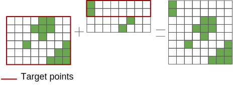
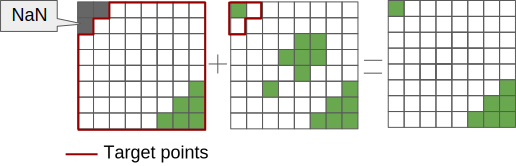
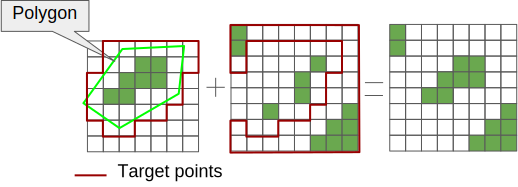

.. _merge:

=====
Merge
=====

Under the general banner of merge, we consider both the filling of missing data and the actual merging between datasets.  Both are handled by the :ref:`ancil_fill_n_merge <ancil_fill_n_merge.py>` application.  For reference documentation see :mod:`ants.analysis`.

Filling datasets
================

Filling missing data often comes into context when making coastlines consistent with an existing landseamask, hence why it is described here in the context of 'merge'.
This requirement is fulfilled by :class:`ants.analysis.FillMissingPoints`, a wrapper around the UM reconfiguration spiral search algorithm with additional benefits such as caching and a more generalised interface.  Other useful tools for filling datasets or even general analysis include the moore neighbourhood search :class:`ants.analysis.MooreNeighbourhood`.

Merging datasets
================

Merging datasets in the context of ANTS is about combining datasets on the same grid.  That is, :func:`ants.analysis.merge` is about 'merging' one or more datasets to form a single dataset.
More than two datasets can be considered by successively merging datasets::

    primary_cube = ...
    new_primary = primary_cube
    for cube in cubes:
        new_primary = merge(new_primary, cube)

In the case where the datasets are not defined on the same coordinate system or their grids are not compatible, the dataset needs to be regridded first, see :ref:`regridding`.

Here are the three common usecases for merging:  The easiest case we can consider is where two sources cover different regions of the same grid.  Merging these datasets is then to simply concatenate these datasets, taking priority of the 'primary' over the 'alternate' dataset in the case of an overlap.

    Figure : Merge usecase where we merge datasets which cover different regions.

Another usecase is where we have NaN values in the 'primary' dataset.  These points are replaced by those defined in the 'alternate' dataset.  This is a useful way to define arbitrary points to inherit from 'alternate', for example using masks to define arbitrary shapes.  Common origins of NaN values in the source can be from a prior regrid, where points of the target extended beyond the source extent.

    Figure : Merge usecase where NaN values are filled.

Our third usecase is to utilise a polygon to define the region of our primary dataset which will end-up on our target.  An example usecase here is the merging of the ITE derived dataset with the CCI/IGBP dataset for the land cover type fraction fields.

    Figure : Merge usecase where the poygon defines the region of interest.
