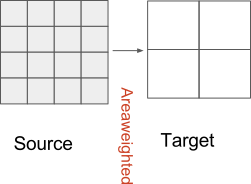
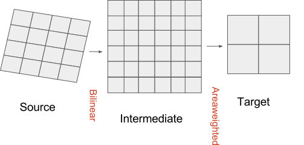

.. _regridding:

=============================
Regridding (A.K.A. remapping)
=============================

Using regridding algorithms
---------------------------

Choosing a regridding scheme for a given problem is a science question rather than strictly a technical one.
Each scheme has it's own characteristics along with benefits and drawbacks and it is for the user to determine
which is appropriate for the given problem.  Common considerations include:

- Does the input fields represent quantities that should be conserved?  For example total emissions over a given area.  If so, a approximately conservative approach should be chosen (for example :class:`ants.regrid.rectilinear.TwoStage`).
- Often a conservative approach is chosen by default, but there are serious performance and memory implications to this.  Ask yourself: 'do you **know** that it needs to be conservative?'  Most historical approaches to the generation of ancillaries are either not conservative at all (using linear or point-in-cell approaches) or are very rough approximations to a conservative approach.
- The relative size of the source and target may be a consideration on which approach is more appropriate than another.  When the source tends to a size similar to the target (or is perhaps coarser than it), performing a conservative regrid will result in abrupt changes in value in the result which is often undersirable.
- Often a nearest neighbour strategy can be used but a linear approach may be more appropriate with an applied threshold.  Which is more appropriate is often determined by what the source field(s) represent.

For example, here we perform a horizontal two-stage regrid::

    >>> scheme = ants.regrid.rectilinear.TwoStage()
    >>> result = source.regrid(target, scheme)

This is often useful for the pre-procesing of datasets as the sources are fixed and the method of regridding should be independent of any user influence.  However, what about generating the ancillary itself, where the user might decide that an alternative scheme is wanted under their specific circumstances (perhaps for a specific source-target pair).  In this case, the :class:`~ants.regrid.GeneralRegridScheme` is useful.

Here, rather than hardcoding a regridding scheme, we use a generic scheme handler which we can define a default horizontal and vertical scheme to be used::

    >>> horizontal_scheme = ants.regrid.rectilinear.Linear()
    >>> scheme = ants.regrid.GeneralRegridScheme(horizontal_scheme=horizontal_scheme)
    >>> scheme
    GeneralRegridScheme(horizontal_scheme=Linear(extrapolation_mode=nan), vertical_scheme=Linear(extrapolation=linear))

Now let's demonstrate overriding these `GeneralRegridScheme` schemes at runtime using a configuration file::

    ....
    [regridding_horizontal]
    scheme = Nearest
    ....

See :ref:`running-applications` for further information on ants configuration files.
Now, the scheme derived previously is overridden::

    >>> scheme
    GeneralRegridScheme(horizontal_scheme=Nearest('extrapolate'), vertical_scheme=Linear(extrapolation=linear))

Similarly, the exact same principle applies to the vertical as with the horizontal shown above (see :class:`ants.regrid.GeneralRegridScheme` for further details and on the default schemes were none are provided).

The purpose of the :class:`ants.regrid.GeneralRegridScheme` and corresponding :class:`ants.regrid.GeneralRegridder` regridder is to:

* Abstract away the concept of performing horizontal and or vertical regridding.

* Provide the user the ability to define their own set of default schemes for their application.

* Allow end-users to override this choice based on the requirements on a case by case basis.  As first described, where this flexibility to the end-user is explicitly not wanted, the user should instead hardcode the regrid scheme as was done in the first illustration of regridding above.

Technical documentation
-----------------------

Here we provide a technical illustration of the two primary means to regrid (remap) ancillaries.  They are :class:`ants.regrid.rectilinear.Linear` and :class:`ants.regrid.rectilinear.TwoStage` regridding.
For the regrid module documentation, the reader is referred to :mod:`ants.regrid`.

The :class:`ants.regrid.rectilinear.Linear` regridder is a simple adaptation of the iris (note that ANTS uses v2.3 of iris which does not support lazy regridding) :class:`iris.analysis.Linear` class except: its default extrapolation mode is 'nan' and it adheres to the concept of coordinate system equivalence.  The reader is referred to the reference documentation for further information.

The two-stage scheme combines the use of :class:`ants.regrid.rectilinear.Linear` with :class:`iris.analysis.AreaWeighted` (note that ANTS uses v2.3 of iris which does not support lazy regridding) to provide fast approximate area weighted regridding in the case where the source and target coordinate systems are not equivalent [#f1]_.

    Figure : Same coordinate system regridding using a straightforward area weighted approach.
    
Generating an ancillary using :class:`~ants.regrid.rectilinear.TwoStage` in the case where source and target coordinate systems are equivalent, renders this a straightforward area weighted regrid with the additional characteristic that target points which lie beyond the source extent are set to NaN values.  This allows us to distinguish between valid masked elements and those cells with no valid values.

    Figure : Different coordinate system regridding using a two-stage approach, a bilinear followed by an area weighted approach.
    
Generating an ancillary using :class:`~ants.regrid.rectilinear.TwoStage` in the case where the source and target coordinate systems are not equivalent [#f1]_ works by a two-stage approach.  First, a bilinear regrid takes place to an intermediate target grid covering the area overlap between source and target.  The shape of the intermediate target matches the source region which overlaps the target and it has the same coordinate system as the final target.  Following this, an area weighted approach is taken between this intermediate target and the final target grid.

.. rubric:: Footnotes

.. [#f1] ANTS defines coordinate systems to be equivalent using :func:`ants.coord_systems.as_ants_crs`.  See :mod:`ants.coord_systems` for further information.
